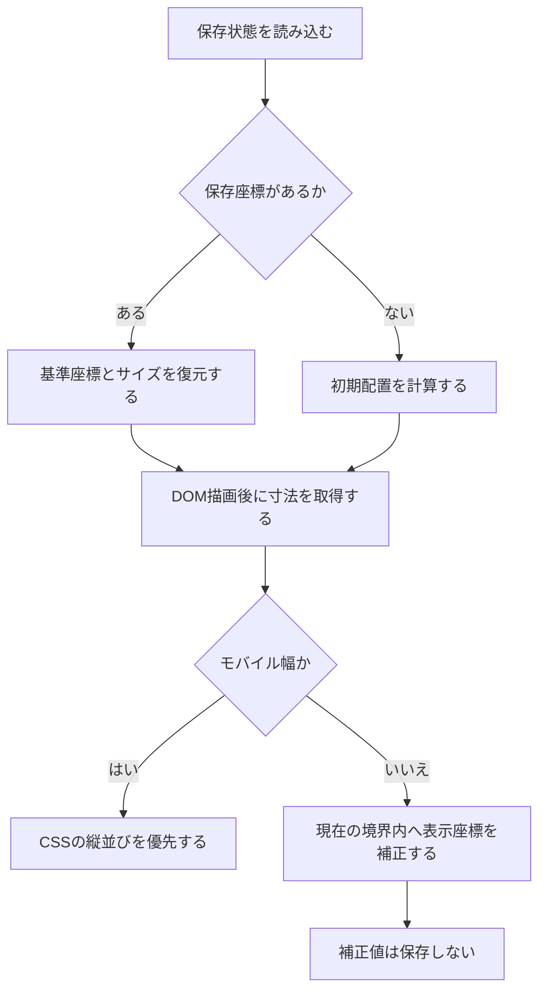
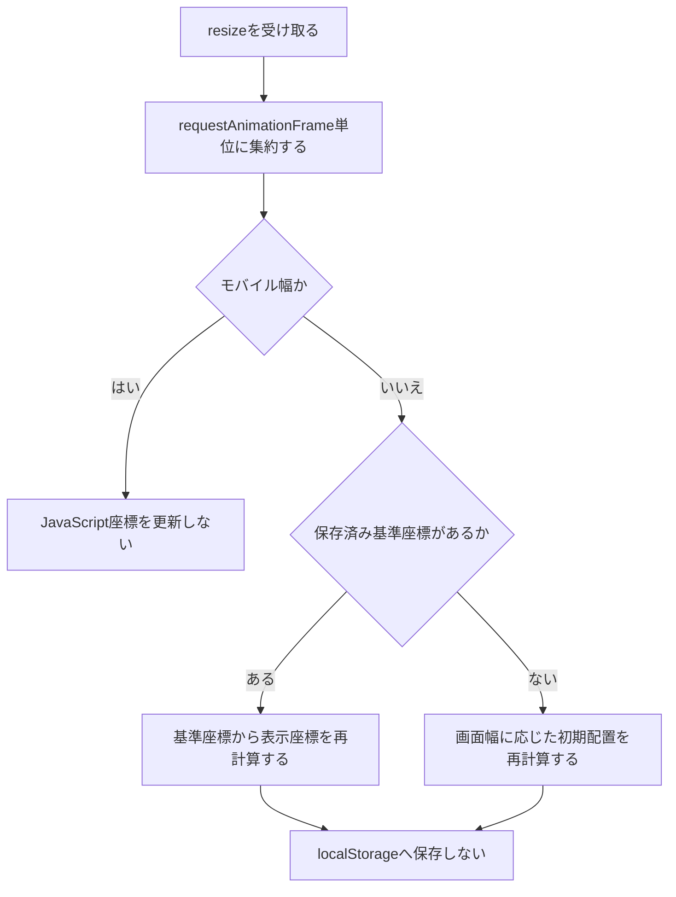
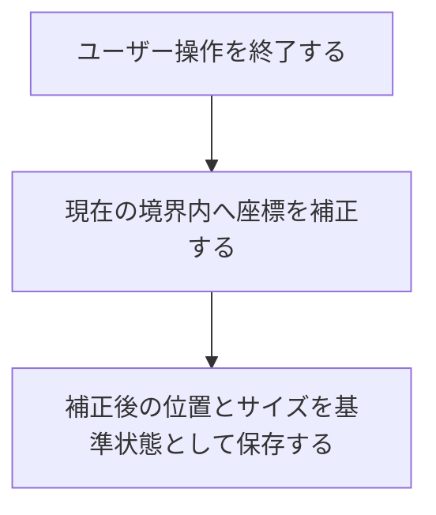

# ウィジェット配置のレスポンシブ対応設計

## 1. 目的

画面サイズや縦横比を変更したとき、ドラッグ配置したウィジェットが表示領域の端へ押し込まれたままになったり、画面外へ移動したまま戻らなくなったりする問題を解消する。

本設計では、ユーザーが決めた配置を可能な限り維持しながら、現在の画面で操作できる位置へ一時的に補正する。

## 2. 対象範囲

対象:

- 通常ウィジェットの `absolute` 配置
- ピン留めウィジェットの `fixed` 配置
- ウィンドウ幅、高さ、縦横比の変更
- 保存済みレイアウトの初回復元
- デスクトップ幅とモバイル幅の相互切り替え
- ドラッグ終了時と手動リサイズ終了時の境界制御

対象外:

- ウィジェット同士の重なり自動解消
- CSS Gridなどを使ったレイアウト方式への全面移行
- 保存形式の大規模な変更
- ウィジェット内容自体のレスポンシブ再設計
- 複数の画面サイズごとに別レイアウトを保存する機能

## 3. 現状

### 3.1 配置方式

- `.dashboard-main` が通常ウィジェットの配置基準である。
- 通常ウィジェットは `position: absolute` で配置する。
- ピン留めウィジェットは `position: fixed` で配置する。
- 画面幅が `768px` 以下の場合、CSSで各ウィジェットを `position: relative`、`width: 100%` に変更して縦並びにする。
- 初期配置は `window.LayoutDefaults.calculateWidgetPositions(containerWidth)` で計算する。

### 3.2 保存状態

`custom_widget_states_v2` に、ウィジェットごとに以下を保存している。

```js
{
    left: string,
    top: string,
    width: string,
    height: string,
    pinned: boolean
}
```

### 3.3 現在のリサイズ処理

保存済み位置を持つ通常ウィジェットについて、右端がコンテナ幅を超えた場合だけ `left` を補正する。

補正後に `saveWidgetState` を呼ぶため、画面を狭くした際の一時的な補正座標が保存座標を上書きする。

ピン留めウィジェットはリサイズ処理の対象外である。

## 4. 問題点

### 4.1 一時的な補正座標が永続化される

例:

1. 幅 `1600px` の画面でウィジェットを右側へ配置する。
2. 幅を `900px` へ狭める。
3. 右端からはみ出すため、ウィジェットが左へ補正される。
4. 補正後の `left` が `localStorage` に保存される。
5. 幅を `1600px` へ戻しても、元の右側の位置へ戻らない。

リサイズによる表示上の補正と、ユーザーが確定した保存位置が同じ値として扱われていることが原因である。

### 4.2 境界判定が右端だけである

現在は次の状態を補正できない。

- `left < 0`
- `top < 0`
- ピン留めウィジェットの右端超過
- ピン留めウィジェットの下端超過
- 保存時とは異なる画面サイズで初回表示した場合

### 4.3 配置基準が異なる

- `absolute` は `.dashboard-main` を基準にする。
- `fixed` はブラウザのビューポートを基準にする。

同じ境界値を使用すると、ピン留め状態によって補正位置がずれる。

### 4.4 モバイルCSSとJavaScriptが競合する可能性がある

`768px` 以下ではCSSが `left`、`top`、`width` を `!important` で上書きする。

この状態でJavaScriptが補正値を保存すると、見た目には反映されないデスクトップ座標だけが変更される。デスクトップ幅へ戻したときに、意図しない位置が復元される原因になる。

## 5. 設計方針

### 5.1 基準座標と表示座標を分離する

座標を次の2種類として扱う。

| 種類 | 説明 | 永続化 |
|---|---|---|
| 基準座標 | ユーザーがドラッグ、サイズ変更、ピン留め操作で確定した位置 | 保存する |
| 表示座標 | 現在の画面内へ収めるために一時補正した位置 | 保存しない |

リサイズ時は、常に保存済みの基準座標から表示座標を再計算する。

この方式により、画面を狭くした後で広げた場合、ウィジェットは基準座標へ戻る。

### 5.2 保存するタイミングを限定する

`saveWidgetState` は、次のユーザー操作が確定した場合だけ呼び出す。

- ドラッグ終了
- 手動リサイズ終了
- ピン留め、ピン留め解除
- 将来追加する明示的なレイアウト保存操作

次の自動処理では呼び出さない。

- `window.resize`
- 初回表示時の境界補正
- モバイル表示への切り替え
- モバイル表示からデスクトップ表示への復帰

### 5.3 座標系ごとに境界を決める

通常ウィジェット:

- 水平方向の基準: `.dashboard-main`
- 垂直方向の基準: `.dashboard-main`
- 下方向: ダッシュボードが縦スクロール可能なため、原則として制限しない

ピン留めウィジェット:

- 水平方向の基準: ビューポート
- 垂直方向の基準: ビューポート
- 上下左右すべてを表示領域内へ収める

### 5.4 モバイル表示では保存座標を変更しない

モバイル相当の狭い表示領域でも、保存済みの基準座標は変更しない。

- JavaScriptによるデスクトップ座標の再保存を行わない。
- ピン留めの保存状態は維持する。
- 現在の表示領域に合わせた表示座標だけを計算する。
- 画面を広げた時点で、保存済みの基準座標から表示座標を再計算する。

メディアクエリによる縦並びへの切り替えは、この原則を実現する必須手段とはしない。

### 5.5 メディアクエリは採用候補に限定する

今回の主問題は、リサイズ時の補正座標を保存してしまうJavaScriptの状態管理にある。

そのため、実装は次の順で判断する。

1. JavaScriptによる基準座標と表示座標の分離を実装する。
2. 通常ウィジェットとピン留めウィジェットの境界補正を実装する。
3. 複数の画面幅、高さ、縦横比で表示を検証する。
4. JavaScriptだけでは解消できない表示上の問題が残るか確認する。
5. メディアクエリの効果が大きく、追加複雑性を上回る場合のみ採用する。

次の条件をすべて満たす場合に限り、メディアクエリを実装する。

- JavaScriptの座標補正では解決できない。
- 対象となる表示崩れを再現できる。
- CSSによる切り替えで明確に操作性または可読性が改善する。
- 保存座標やドラッグ配置の責務と競合しない。
- 特定端末だけでなく、一定範囲の画面条件に有効である。
- 追加するブレークポイントと上書き規則をテストできる。

効果が限定的、またはJavaScriptの座標補正と重複する場合は採用しない。

既存の `styles/layout-edit.css` には `max-width: 768px` のメディアクエリがあるが、これも継続利用を前提としない。

JavaScript修正後の比較検証で、次のいずれかを判断する。

- 明確な効果がある場合は、必要な規則だけを維持する。
- 効果がない場合は、新しいメディアクエリを追加しない。
- JavaScript処理と競合する場合は、既存規則の縮小または削除を検討する。

### 5.6 ブレークポイント候補

以下は実装確定値ではなく、ブラウザ検証で効果を比較するための候補である。

| 条件候補 | 想定する用途 | 採用判断 |
|---|---|---|
| `max-width: 768px` | 自由配置から縦並びへの切り替え | 座標補正後も操作性が低い場合のみ |
| `max-width: 480px` | 外側余白やサイドバー幅の縮小 | 横スクロールや操作領域不足が残る場合のみ |
| `max-height: 600px` | 上下余白の縮小 | 低高さ画面で主要操作が隠れる場合のみ |
| `orientation: landscape` かつ `max-height: 500px` | 横向き端末の縦領域確保 | 高さ条件だけでは不足する場合のみ |
| `(hover: none), (pointer: coarse)` | マウス向け編集操作の抑制 | タッチ操作で誤操作を再現できる場合のみ |
| `prefers-reduced-motion: reduce` | アニメーション抑制 | アクセシビリティ対応として独立採用を検討 |

初期配置の3列、2列、1列計算に使う `1052px` と `700px` は、現在どおりJavaScriptが `.dashboard-main` の利用可能幅を基準に判断する。

### 5.7 採用した場合の管理方法

メディアクエリを採用すると判断した場合にのみ、次を実施する。

- 採用理由と解決対象を設計書へ記録する。
- JavaScriptでも同じ条件を参照する必要がある場合は、対応する定数を定義する。
- 境界値の直前と直後をブラウザテストへ追加する。
- 不要なブレークポイントを増やさない。
- CSS上書きは解決対象へ限定する。

### 5.8 コンテナクエリ

現段階ではコンテナクエリを必須にしない。

理由:

- ウィジェット自体がドラッグとリサイズによって任意幅になる。
- ページ全体の配置モードは `.dashboard-main` とビューポートの両方に依存する。
- 現在の主要問題は保存座標の永続化であり、コンテナクエリだけでは解決できない。

ただし、ウィジェット内部の表示切り替えには将来的に有効である。

候補:

- 天気グラフを狭いウィジェット幅で非表示または下段へ移動する。
- Spotifyの曲情報と操作ボタンを狭い幅で縦積みにする。
- Discoverの検索欄とタブを狭い幅で折り返す。

この場合は、`.sortable-item` または各ウィジェットへ `container-type: inline-size` を設定し、配置制御ではなく内部UIだけに使用する。

## 6. 座標補正仕様

### 6.1 水平方向

```text
maxLeft = max(0, boundaryWidth - widgetWidth)
displayLeft = min(max(baseLeft, 0), maxLeft)
```

これにより次を保証する。

- 左端が境界より左へ出ない。
- 右端が境界より右へ出ない。
- ウィジェット幅が境界幅より大きい場合は、左端を `0` にする。

### 6.2 垂直方向

通常ウィジェット:

```text
displayTop = max(baseTop, 0)
```

ピン留めウィジェット:

```text
maxTop = max(0, viewportHeight - widgetHeight)
displayTop = min(max(baseTop, 0), maxTop)
```

### 6.3 寸法取得

優先順位:

1. `getBoundingClientRect()` の実測値
2. 保存済みまたはインライン指定の `width` / `height`
3. `offsetWidth` / `offsetHeight`
4. 既定値

非表示ウィジェットでは実測値が `0` になる可能性があるため、単一の取得方法へ依存しない。

### 6.4 `calc()` の扱い

初期Spotify配置には `calc()` が使われている。

`parseFloat()` だけでは正しい座標を取得できないため、数値化できない場合は `getBoundingClientRect()` の実測座標を基準値として使う。

## 7. 処理フロー

### 7.1 初回表示



### 7.2 ウィンドウリサイズ



### 7.3 ドラッグまたは手動リサイズ



ユーザーが画面外へ配置した場合は、操作終了時点で画面内へ戻し、その位置を新しい基準座標として保存する。

## 8. 実装構成

### 8.1 `js/layout.js`

追加予定:

- ウィジェットの境界と寸法を計算する処理
- 基準座標を表示領域内へクランプする処理
- 初回描画後の境界補正
- `resize` の `requestAnimationFrame` による集約

変更予定:

- `handleWindowResize` から `saveWidgetState` を呼ばない。
- ピン留めウィジェットもリサイズ補正対象にする。
- ドラッグ終了時、手動リサイズ終了時、ピン留め切り替え時に境界補正してから保存する。

### 8.2 メディアクエリ採用時のCSS構成候補

ブラウザ検証の結果、メディアクエリの採用効果が十分に大きいと判断した場合は、`styles/responsive.css` の新設を候補とする。

採用時に専用ファイルを使う理由:

- 現在の `layout-edit.css` は `ai.css`、`discover.css`、`weather.css`、`todo.css`、`spotify.css` より先に読み込まれる。
- 後から読み込まれるウィジェットCSSに同等以上の詳細度や `!important` があると、モバイル規則が上書きされる可能性がある。
- レスポンシブ規則を最後に読み込むことで、ファイル間の読み込み順を明確なカスケード方針として利用できる。
- 各ウィジェットの基本スタイルと、画面条件による上書きを分離できる。

`index.html` の読み込み順:

```html
<link rel="stylesheet" href="styles/widgets/spotify.css">
<link rel="stylesheet" href="styles/responsive.css">
```

以下は採用を決定した場合の参考案であり、現段階の実装要件ではない。

検討対象:

- `768px` 以下では編集モードでも `position: relative` が優先されるよう、対象を `.dashboard-main.layout-edit-active > .sortable-item` まで明示する。
- モバイル時は `.widget-pinned` の `position: fixed !important` を確実に無効化する。
- モバイル時は `resize: none` とし、タッチ操作中の意図しないウィジェットサイズ変更を防ぐ。
- モバイル時はドラッグ用の疑似要素を非表示にする。
- 幅広ウィジェットを含め、`max-width: 100%` と `box-sizing: border-box` を保証する。

想定する基本ルール:

```css
/* JavaScriptのMOBILE_LAYOUT_MEDIA_QUERYと同期する。 */
@media (max-width: 768px) {
  body {
    padding: var(--space-lg);
  }

  .dashboard {
    min-height: calc(100dvh - (var(--space-lg) * 2));
    height: auto;
  }

  .dashboard-main {
    overflow: visible;
    padding: var(--space-xl) 0;
  }

  .dashboard-main > .sortable-item,
  .dashboard-main > .sortable-item.widget-pinned,
  .dashboard-main.layout-edit-active > .sortable-item {
    position: relative !important;
    inset: auto !important;
    width: 100% !important;
    max-width: 100% !important;
    margin-bottom: var(--widget-gap);
    resize: none;
  }

  .layout-edit-active .sortable-item::before,
  .widget-pin-btn {
    display: none !important;
  }
}
```

`inset: auto !important` により、`left` と `top` だけでなく、将来 `right` や `bottom` が追加された場合も固定配置の残留を防ぐ。

### 8.3 `styles/layout-edit.css`

基本となる編集モードの見た目とデスクトップ向け操作だけを保持する。

メディアクエリを採用する場合でも、変更は採用理由に直接関係する範囲へ限定する。

### 8.4 `styles/base.css`

メディアクエリ採用時の検討候補:

- `768px` 以下でbodyとダッシュボードの余白を縮める。
- モバイルでは固定の `100vh` 高さに依存せず、ブラウザUIの伸縮へ追従しやすい `100dvh` を使用する。
- `480px` 以下ではさらに余白を縮める。
- 横スクロールの原因を隠すだけの `overflow-x: hidden` は原則として使用せず、はみ出す要素自体を修正する。

想定するコンパクトルール:

```css
@media (max-width: 480px) {
  body {
    padding: var(--space-md);
  }

  .dashboard-main {
    padding-top: var(--space-lg);
  }
}

@media (max-height: 600px) {
  body {
    padding-top: var(--space-md);
    padding-bottom: var(--space-md);
  }
}

@media (orientation: landscape) and (max-height: 500px) {
  .app-header {
    margin-bottom: var(--space-sm);
  }

  .dashboard-main {
    padding-top: var(--space-md);
  }
}
```

### 8.5 `styles/sidebar.css`

メディアクエリ採用時の検討候補:

- `480px` 以下ではサイドバーを `width: min(100%, var(--sidebar-width))` とし、画面幅を超えないようにする。
- `env(safe-area-inset-*)` を考慮し、ノッチやホームインジケータと操作要素の重なりを避ける。

### 8.6 ウィジェット固有CSS

検討対象:

- 天気: 狭い幅ではグラフを下段へ移動し、必要なら横スクロール可能にする。
- Todo: 見出しとカレンダー取込ボタンを折り返し可能にする。
- Spotify: プレイヤー操作を縦積みし、曲名領域の最小幅を確保する。
- Discover: 検索欄とタブを折り返し、入力欄が操作可能な幅を維持する。
- クイックリンク: ウィジェット全体ではなくリンク一覧だけを横スクロールさせる。

基本スタイルは各 `styles/widgets/*.css` に保持する。画面幅に依存する上書きが必要と判断した場合のみ追加する。

将来コンテナクエリを導入する場合は、対象ウィジェットのCSS内に配置する。

### 8.7 入力方式とアクセシビリティ

以下は、タッチ操作やアニメーションによる具体的な問題を確認できた場合の候補である。

```css
@media (hover: none), (pointer: coarse) {
  .layout-edit-active .sortable-item {
    resize: none;
  }
}

@media (prefers-reduced-motion: reduce) {
  .sortable-item,
  .sidebar,
  .sidebar-overlay {
    transition: none !important;
  }
}
```

`hover: none` と `pointer: coarse` は画面幅とは独立して適用する。タッチ対応の大型端末でも、マウス前提の操作を誤って有効にしないためである。

### 8.8 `js/layout-defaults.js`

既存の初期配置計算を維持する。

保存座標がないウィジェットは、画面幅変更時に既存の3列、2列、1列配置を再計算する。

## 9. 状態互換性

保存キー `custom_widget_states_v2` と現在のオブジェクト形式は変更しない。

理由:

- 今回必要なのは保存データの変更ではなく、保存値と表示値の扱いの分離である。
- キー変更や移行処理を追加せずに既存ユーザーの配置を引き継げる。

保存済み座標が画面外にある場合も削除せず、表示時だけ補正する。

## 10. 受け入れ条件

### 10.1 通常ウィジェット

- 画面を狭くしても、ウィジェット全体または操作可能部分が水平方向の表示領域内に残る。
- 画面を元の幅へ戻すと、リサイズ前の基準位置へ戻る。
- 左端が負の保存座標でも画面外へ消えない。
- 上端が負の保存座標でも画面外へ消えない。
- リサイズだけでは `localStorage` の配置状態が変更されない。

### 10.2 ピン留めウィジェット

- 画面幅を狭くしても左右の画面外へ消えない。
- 画面高を低くしても上下の画面外へ消えない。
- 画面サイズを戻すと保存済みの基準位置へ戻る。

### 10.3 モバイル

- 横スクロールが発生しない。
- 狭い表示領域でもウィジェットを操作できる。
- 狭い表示領域への変更中に保存済み基準座標が変更されない。
- 画面を広げると、保存済みレイアウトを基準に再配置される。
- メディアクエリを採用しない場合でも、JavaScriptの境界補正だけで主要操作へアクセスできる。
- メディアクエリを採用する場合は、採用前より操作性または可読性が明確に改善する。

### 10.4 ユーザー操作

- ドラッグ終了後、ウィジェットが完全に画面外へ残らない。
- 手動リサイズ終了後、ウィジェットの右端が操作不能な位置へ残らない。
- ピン留め切り替え後、座標系の変換によって画面外へ移動しない。

## 11. 検証計画

### 11.1 機械検証

- 全JavaScriptの `node --check`
- `git diff --check`
- 既存iCal parserテスト

### 11.2 ブラウザ検証

次のビューポートで確認する。

| 幅 | 高さ | 目的 |
|---:|---:|---|
| 1440 | 900 | 標準デスクトップ |
| 1024 | 768 | 小型デスクトップ |
| 800 | 600 | 狭いデスクトップ |
| 768 | 1024 | ブレークポイント候補の評価 |
| 769 | 1024 | 候補境界直後の比較 |
| 480 | 800 | コンパクト候補の評価 |
| 481 | 800 | 候補境界直後の比較 |
| 390 | 844 | スマートフォン |
| 844 | 390 | スマートフォン横向き |

主要シナリオ:

1. 右端へ配置してから画面を狭め、再び広げる。
2. 左端が負になるように保存状態を作り、再読み込みする。
3. Spotifyを含むピン留めウィジェットで幅と高さを変更する。
4. デスクトップからモバイルへ変更し、再びデスクトップへ戻す。
5. 編集モードでウィジェットをリサイズし、画面サイズを変更する。
6. ページ再読み込み後も基準配置が維持されることを確認する。
7. メディアクエリなしの実装で、`768px`、`480px`、横向き表示を確認する。
8. JavaScriptの境界補正だけでは解決できない表示崩れがあるか記録する。
9. 問題が残る場合だけメディアクエリ案を一時適用し、採用前後を比較する。
10. 改善効果が明確でなければメディアクエリ案を採用しない。
11. 採用した場合のみ、境界値直前と直後、タッチ入力、低モーション設定を追加検証する。

## 12. リスクと対策

| リスク | 対策 |
|---|---|
| `resize` が高頻度に発生して描画負荷が上がる | `requestAnimationFrame` で1フレームに1回へ集約する |
| 非表示ウィジェットの寸法が0になる | 保存寸法、インライン寸法、既定寸法へフォールバックする |
| CSSの `!important` とJavaScript座標が競合する | メディアクエリを安易に追加せず、採用時も責務と対象を限定する |
| `fixed` と `absolute` の座標変換で位置がずれる | 切り替え直前の `getBoundingClientRect()` を使う |
| 広い画面へ戻しても補正位置が残る | リサイズ補正を永続化せず、毎回基準座標から計算する |

## 13. 実装順序

1. 境界計算と座標クランプ処理を分離する。
2. リサイズ時の保存処理を廃止する。
3. 初回表示時の補正を追加する。
4. ピン留めウィジェットを補正対象にする。
5. ドラッグ、手動リサイズ、ピン留め切り替えの保存前補正を追加する。
6. 構文確認と既存テストを実行する。
7. メディアクエリを追加せず、複数ビューポートで往復リサイズを検証する。
8. JavaScriptだけでは解決できない表示問題が残るか評価する。
9. メディアクエリの効果が明確に大きい場合のみ、最小範囲で追加する。
10. メディアクエリを追加した場合は、採用前後の比較と境界値テストを実施する。

## 14. 実装結果

### 14.1 JavaScript

`js/layout.js` に次を実装した。

- 基準座標と表示座標の分離
- 通常ウィジェットの左右と上端の境界補正
- ピン留めウィジェットの上下左右の境界補正
- 初回表示時の保存座標補正
- `requestAnimationFrame` によるリサイズ処理の集約
- ドラッグ、手動リサイズ、ピン留め切り替えの保存前補正
- `calc()` 座標と非表示ウィジェット寸法のフォールバック

リサイズによる自動補正では `localStorage` を更新しない。

### 14.2 メディアクエリ

新しいメディアクエリは追加しなかった。

既存の `styles/layout-edit.css` にある `max-width: 768px` の規則は、次の効果をブラウザ検証で確認できたため維持する。

- `390x844` で表示中ウィジェットが通常フローの縦並びになる。
- ドキュメントの `scrollWidth` がビューポート幅と同じ `390px` になり、横スクロールが発生しない。
- 表示中ウィジェットの左右端がビューポート内に収まる。
- モバイル幅で表示しても保存済み基準座標が変更されない。
- デスクトップ幅へ戻したとき、保存済み基準座標から表示位置が再計算される。

既存規則は狭い画面での操作可能性に対して効果が明確であり、今回のJavaScript修正とも責務が競合しない。

追加候補として検討した `480px`、低高さ、横向き、入力方式に関するメディアクエリは、今回の問題を解決するための必要性が確認できなかったため実装していない。

### 14.3 ブラウザ検証結果

| シナリオ | 結果 |
|---|---|
| `1440x900` で通常ウィジェットを右側へ保存 | 基準座標どおり表示 |
| `900x500` へ縮小 | 通常ウィジェットとピン留めウィジェットが画面内へ補正 |
| 再び `1440x900` へ拡大 | 両ウィジェットが保存済み基準位置へ復帰 |
| 負の `left` / `top` を保存して再読み込み | 初回表示で `0px` 以上へ補正し、保存値は変更されない |
| `390x844` へ縮小 | 横スクロールなし、保存値変更なし |
| ピン留めと解除を往復 | 画面上の表示位置を維持 |

検証に使用した一時的な `localStorage` データは、検証終了後に元の状態へ復元した。

### 14.4 Discoverと共通リサイズ

Discoverの可変サイズ対応として、次を実装した。

- DiscoverとAI検索の既定幅に付いていた `!important` を外し、保存済みインライン幅を優先する。
- Discover内部のヘッダーと操作群を折り返し可能にする。
- 検索欄を利用可能幅に応じて伸縮させる。
- 記事一覧を残り高さへ追従させ、指定高を超える内容は一覧内でスクロールする。
- 記事本文領域へ `min-width: 0` を設定し、狭い幅でも操作ボタンを押し出さない。

全ウィジェットのサイズ変更は、左上位置を固定し、右下の角を操作する方式へ統一した。

編集モードでは、右下に共通の視覚的なリサイズハンドルを表示する。ブラウザ標準の `resize: both` を利用するため、右下から左上へドラッグすると縮小し、右下方向へドラッグすると拡大する。

ブラウザ検証では、Discoverの保存幅 `460px`、保存高 `360px` が復元され、次を確認した。

- 計算後の幅と高さが保存値と一致する。
- ヘッダーと操作群がウィジェット幅内で折り返す。
- 記事一覧が残り高さを使用し、`overflow: auto` になる。
- 全ウィジェットに `resize: both` と右下ハンドルが適用される。
